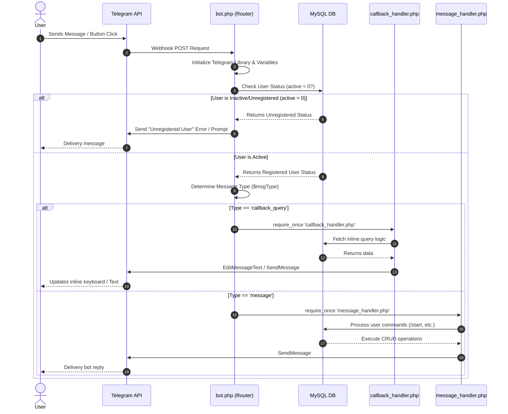

# Application Architecture Flow

This document visualizes the sequence of operations within the TBOT_Azmona bot routing logic.

```mermaid
sequenceDiagram
    autonumber
    actor User
    participant Telegram as Telegram API
    participant Bot as bot.php (Router)
    participant DB as MySQL DB
    participant Callback as callback_handler.php
    participant Message as message_handler.php

    User->>Telegram: Sends Message / Button Click
    Telegram->>Bot: Webhook POST Request
    
    Bot->>Bot: Initialize Telegram Library & Variables
    
    Bot->>DB: Check User Status (active = 0?)
    alt User is Inactive/Unregistered (active = 0)
        DB-->>Bot: Returns Unregistered Status
        Bot->>Telegram: Send "Unregistered User" Error / Prompt
        Telegram-->>User: Delivery message
    else User is Active
        DB-->>Bot: Returns Registered User Status
        
        Bot->>Bot: Determine Message Type ($msgType)
        
        alt Type == 'callback_query'
            Bot->>Callback: require_once 'callback_handler.php'
            Callback->>DB: Fetch inline query logic
            DB-->>Callback: Returns data
            Callback->>Telegram: EditMessageText / SendMessage
            Telegram-->>User: Updates inline keyboard / Text
            
        else Type == 'message'
            Bot->>Message: require_once 'message_handler.php'
            Message->>DB: Process user commands (/start, etc.)
            DB-->>Message: Execute CRUD operations
            Message->>Telegram: SendMessage
            Telegram-->>User: Delivery bot reply
        end
    end
```
